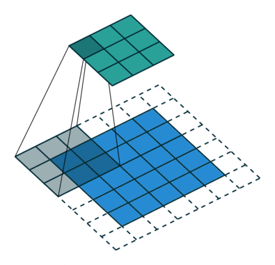

# c3ann
#### by Cris Ghiurea

## Demo
[https://c3cris.github.io/c3ann/](https://c3cris.github.io/c3ann/)

c3ann is a proof of concept of a Digit Recognition by Convolutional Artificial Neural Network. 

### Screenshot

## Convolution 

### General Convolution 
$${g(x,y)=\omega *f(x,y)=\sum _{dx=-a}^{a}{\sum _{dy=-b}^{b}{\omega (dx,dy)f(x-dx,y-dy)}}}$$

#### Box Blur Kernel

$${\frac {1}{9}}{\begin{bmatrix}\ \ 1&\ \ 1&\ \ 1\\\ \ 1&\ \ 1&\ \ 1\\\ \ 1&\ \ 1&\ \ 1\end{bmatrix}}$$

### Weights Calculated

$$\sum = (x_1 \times  w_1 ) +(x_2 \times  w_2 ) + \cdots + (x_n \times  w_n )$$

### Activation Function = Sigmoid

$$\textrm{Sigmoid} = \frac{1}{1+e^{-x}}$$

$$\textrm{Sigmoid}' = \frac{e^{-x}}{\left ( 1+e^{-x}  \right )^{2}}$$

